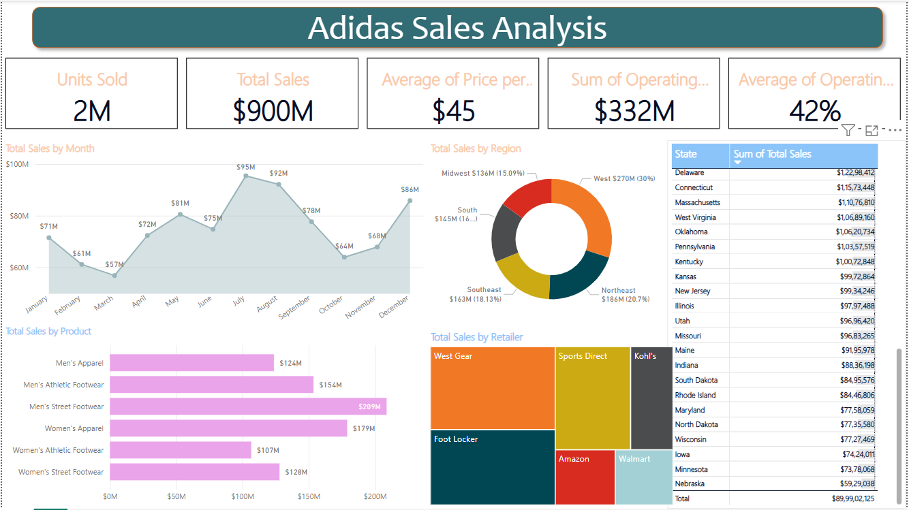

# 👟 Power BI Dashboard – Adidas Sales Analysis

## 📌 Table of Contents
- [About](#about)
- [Project Description](#project-description)
- [What I Did](#what-i-did)
- [Main Key Points](#main-key-points)
- [Dashboard Preview](#dashboard-preview)
- [Usage](#usage)
- [Features](#features)
- [How to Open](#how-to-open)

---

## 📖 About

This Power BI project visualizes Adidas sales data to derive business insights using interactive dashboards. It combines **Power Query** for data transformation and **DAX** for custom KPIs and calculations.

---

## 📂 Project Description

**Tool Used**: Power BI  
**File**: `Adidas-sales-dashboard.pbix`  
**Domain**: Retail / Sales Analytics  
**Objective**: Deliver a clean, dynamic dashboard to analyze Adidas product performance, profitability, and regional trends.

---

## ✅ What I Did

- Imported and transformed raw Adidas sales data using **Power Query Editor**
- Cleaned and shaped data (renamed columns, changed types, handled missing values)
- Created data model and defined relationships between tables
- Used **DAX** to create calculated columns and measures such as:
  - Average Selling Price
  - Operating Margin %
  - Total Profit
  - Year-Month hierarchy for time-based trends
- Designed an interactive dashboard layout with responsive visuals and slicers

---

## 📌 Main Key Points

- 📈 **Monthly Sales Trend**: Highlights peaks and dips in sales performance
- 🛍️ **Top-Selling Products**: Analyzed by category (e.g., footwear, apparel)
- 🌍 **Sales by Region**: Donut chart showing contribution from West, Northeast, etc.
- 🏬 **Retailer Analysis**: Treemap comparison of major retailers like Amazon, Foot Locker
- 📌 **DAX Measures Created**:
  - `Total Sales = SUM(Sales[Sales Amount])`
  - `Average Price = [Total Sales] / [Units Sold]`
  - `Operating Margin % = [Operating Profit] / [Total Sales]`
- ⚙️ **Power Query Tasks**:
  - Filtered rows
  - Changed data types
  - Created custom columns
  - Merged tables if needed

---

## 🖼️ Dashboard Preview

---

## 🚀 Usage

1. Install **Power BI Desktop** from [here](https://powerbi.microsoft.com/desktop)
2. Open `Adidas-sales-dashboard.pbix`
3. Use filters and slicers to explore data by region, product category, and time

---

## ✨ Features

- 📊 KPI Cards for performance metrics (Units Sold, Sales, Profit, Margin)
- 📈 Line Charts for time series trends
- 📍 Donut + Bar Charts for regional and category-based sales
- 🧩 Treemap for retailer sales analysis
- 🧠 Use of **Power Query** for preprocessing and **DAX** for logic and formulas

---

## 🛠️ How to Open

1. Download and install Power BI Desktop
2. Open `Adidas-sales-dashboard.pbix`
3. Navigate through pages and interact with visual filters
